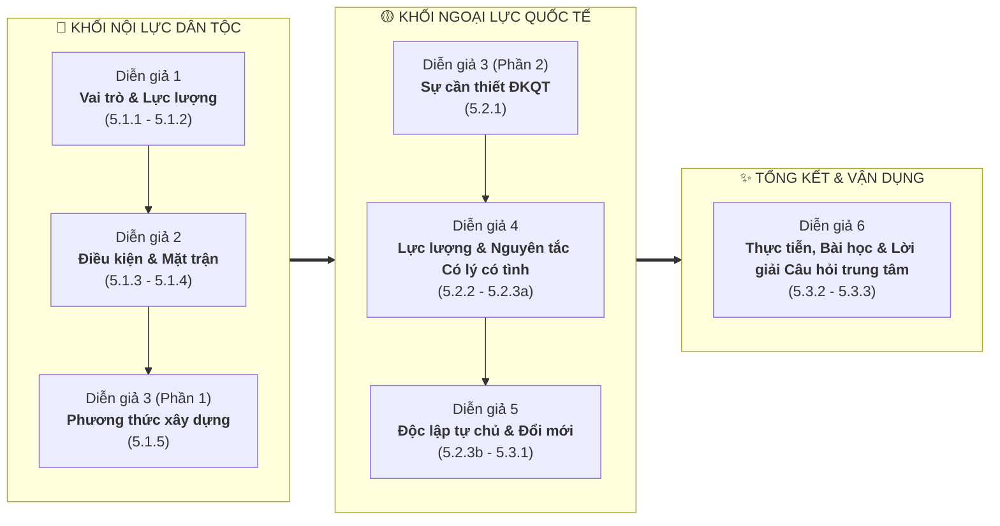

# 🇻🇳 HCM202 - Chương 5: Tư Tưởng Hồ Chí Minh Về Đại Đoàn Kết Toàn Dân Tộc & Đoàn Kết Quốc Tế

> **Website Thuyết Trình & Học Tập Tương Tác Số Hóa**  
> Môn học: **Tư tưởng Hồ Chí Minh (HCM202)** — Nhóm 7 (Chapter 5)  
> *Được xây dựng & tối ưu hóa dựa trên dàn ý chuẩn của bài thuyết trình 6 diễn giả.*

---

## 🌟 Giới Thiệu & Câu Hỏi Trọng Tâm

Dự án là nền tảng học tập đa phương tiện (EdTech Web App) số hóa toàn bộ nội dung học phần **Chương 5: Tư tưởng Hồ Chí Minh về đại đoàn kết toàn dân tộc và đoàn kết quốc tế**. Website kết hợp hiệu ứng đồ họa tương tác 3D, dòng thời gian sinh động, lộ trình thuyết trình diễn giả và hệ thống trắc nghiệm chấm điểm tự động kết nối Realtime Google Sheets.

### 🎯 Câu Hỏi Trọng Tâm Xuyên Suốt:
> **"Lợi ích dân tộc và hợp tác quốc tế có thể bổ trợ nhau như thế nào?"**

---

## 👥 Cấu Trúc Nội Dung Thuyết Trình (6 Diễn Giả)



---

### 👤 Diễn Giả 1: Vai Trò & Nền Tảng Khối Đại Đoàn Kết (Mục 5.1.1 & 5.1.2)
* **Vai trò chiến lược:** Đại đoàn kết toàn dân tộc là vấn đề sống còn, có ý nghĩa chiến lược lâu dài, quyết định mọi thắng lợi của cách mạng.
* **Mục tiêu cách mạng:** Đoàn kết là mục tiêu, nhiệm vụ hàng đầu của Đảng và dân tộc.
* **Luận điểm kinh điển:** *"Đoàn kết, đoàn kết, đại đoàn kết — Thành công, thành công, đại thành công"*.
* **Lực lượng đoàn kết:** Toàn thể nhân dân Việt Nam yêu nước, không phân biệt giai cấp, dân tộc, tôn giáo; lấy **Liên minh Công - Nông - Trí thức** làm nền tảng dưới sự lãnh đạo của Đảng.

---

### 👤 Diễn Giả 2: Điều Kiện Xây Dựng & Hình Thức Tổ Chức Mặt Trận (Mục 5.1.3 & 5.1.4)
* **4 Điều kiện xây dựng khối đại đoàn kết:**
  1. *Lấy lợi ích chung làm điểm quy tụ:* Độc lập dân tộc và hạnh phúc nhân dân là "mẫu số chung".
  2. *Kế thừa truyền thống dân tộc:* Yêu nước, nhân nghĩa, tương thân tương ái.
  3. *Lòng khoan dung, độ lượng:* *"Năm ngón tay có ngón dài ngón ngắn, nhưng cả năm ngón đều thuộc về một bàn tay"*.
  4. *Niềm tin tuyệt đối vào nhân dân:* Dân là gốc, dựa vào sức mạnh quần chúng.
* **Hình thức tổ chức:** Mặt trận Dân tộc Thống nhất qua các thời kỳ:
  * `1930`: Hội Phản đế Đồng minh
  * `1941`: Mặt trận Việt Minh
  * `1951`: Mặt trận Liên Việt
  * `1955 / 1977 – Nay`: Mặt trận Tổ quốc Việt Nam.
* **Nguyên tắc hoạt động:** Dựa trên nền tảng Công - Nông - Trí; Hiệp thương dân chủ; Cầu đồng tồn dị.

---

### 👤 Diễn Giả 3: Phương Thức Thực Hiện & Sự Cần Thiết Đoàn Kết Quốc Tế (Mục 5.1.5 & 5.2.1)
* **Phương thức xây dựng:** Dân vận sâu rộng $\rightarrow$ Thành lập các đoàn thể quần chúng $\rightarrow$ Tập hợp trong Mặt trận.
* **Sự cần thiết của đoàn kết quốc tế:**
  $$\text{Sức mạnh Dân tộc} + \text{Sức mạnh Thời đại} = \text{Sức mạnh Tổng hợp}$$
* **Nhận thức thời đại:** Cách mạng Việt Nam là một bộ phận không thể tách rời của cách mạng thế giới.
* **4 Mục tiêu thời đại:** Hòa bình, Độc lập dân tộc, Dân chủ và Chủ nghĩa xã hội.

---

### 👤 Diễn Giả 4: Lực Lượng Quốc Tế, Mô Hình 4 Tầng Mặt Trận & "Có Lý, Có Tình" (Mục 5.2.2 & 5.2.3.a)
* **3 Lực lượng quốc tế trọng tâm:**
  1. Phong trào cộng sản và công nhân quốc tế.
  2. Phong trào đấu tranh giải phóng dân tộc.
  3. Các lực lượng tiến bộ, yêu chuộng hòa bình, công lý trên toàn cầu.
* **Mô hình 4 Tầng Mặt trận Quốc tế:**
  * `Tầng 1`: Mặt trận Đại đoàn kết toàn dân tộc.
  * `Tầng 2`: Mặt trận Đoàn kết Liên minh Việt – Miên – Lào.
  * `Tầng 3`: Mặt trận Nhân dân Á – Phi đoàn kết với Việt Nam.
  * `Tầng 4`: Mặt trận Nhân dân thế giới đoàn kết chống xâm lược, bảo vệ hòa bình.
* **Nguyên tắc "Có lý, có tình":**
  * *"Có lý":* Kiên định mục tiêu hòa bình, tôn trọng độc lập, chủ quyền và toàn vẹn lãnh thổ.
  * *"Có tình":* Chân thành, thủy chung, hữu nghị — *"Làm bạn với tất cả các nước dân chủ và không gây thù oán với một ai"*.

---

### 👤 Diễn Giả 5: Nguyên Tắc "Độc Lập Tự Chủ" & Đường Lối Đối Ngoại Đổi Mới (Mục 5.2.3.b & 5.3.1)
* **Tự lực cánh sinh:** *"Đem sức ta mà tự giải phóng cho ta"*, *"Muốn người ta giúp cho, thì trước mình phải tự giúp lấy mình đã"*.
* **Triết lý thực lực ngoại giao:** *"Thực lực là cái chiêng, ngoại giao là cái tiếng, chiêng có to tiếng mới lớn"*.
* **Bước chuyển tư duy đối ngoại qua các kỳ Đại hội Đảng:**
  * `Đại hội VII (1991)`: *"Việt Nam muốn là bạn với tất cả các nước..."*
  * `Đại hội VIII (1996)`: *"Việt Nam sẵn sàng là bạn, là đối tác tin cậy..."*
  * `Đại hội IX – XIII`: *"Việt Nam là bạn, là đối tác tin cậy và là thành viên tích cực, có trách nhiệm trong cộng đồng quốc tế"*.

---

### 👤 Diễn Giả 6: Vận Dụng Hiện Nay, Bài Học & Trả Lời Câu Hỏi Trọng Tâm (Mục 5.3.2 & 5.3.3)
* **Thực tiễn sinh động:** Tham gia lực lượng Gìn giữ hòa bình Liên Hợp Quốc (UN Peacekeeping từ 2014), ngoại giao cây tre Việt Nam.
* **4 Bài học kinh nghiệm:** Nắm vững ngọn cờ độc lập & CNXH; Kết hợp chặt chẽ nội lực và ngoại lực; Giữ vững nguyên tắc tự chủ; Linh hoạt mềm dẻo về sách lược.
* **🎯 Trả lời câu hỏi trọng tâm (Mối quan hệ 2 chiều biện chứng):**
  * 🔄 **Chiều 1 (Quốc tế $\rightarrow$ Dân tộc):** Hợp tác quốc tế là *phương thức quan trọng* để bảo vệ, phát triển và tối đa hóa lợi ích dân tộc (thu hút FDI, chuyển giao công nghệ, mở rộng thị trường, bảo vệ tổ quốc từ sớm, từ xa).
  * 🔄 **Chiều 2 (Dân tộc $\rightarrow$ Quốc tế):** Lợi ích quốc gia - dân tộc chân chính là *nguyên tắc tối cao, ngọn hải đăng* định hướng mọi quan hệ đối ngoại; xây dựng nội lực vững mạnh để đóng góp trách nhiệm cho hòa bình thế giới.

---

## 💻 Công Nghệ & Tính Năng Đột Phá

| Công nghệ / Thư viện | Ứng dụng & Trải nghiệm |
| :--- | :--- |
| **React 18 & Styled-Components** | Xây dựng UI Component hóa cao cấp, hỗ trợ CSS glassmorphism, gradient vàng kim và đỏ cờ Tổ quốc. |
| **Three.js & Canvas** | Tích hợp **Tượng Chủ tịch Hồ Chí Minh 3D tương tác** xoay/thu phóng và hệ thống hạt ánh sáng (Particle System). |
| **GSAP & ScrollTrigger** | Trình diễn chuyển động mượt mà, cuộn trang tương tác theo dòng lịch sử. |
| **Swiper 3D Coverflow** | Trình chiếu trực quan 4 Tầng Mặt trận và kho tư liệu hình ảnh lịch sử. |
| **ReviewQuiz (Gamification)** | 10 câu hỏi bao quát trọn vẹn 6 phần kiến thức: Trắc nghiệm nhiều lựa chọn & Kéo thả ghép cặp 4 Tầng Mặt trận. |
| **Web Audio API** | Hiệu ứng âm thanh khi bấm, trả lời đúng/sai, âm thanh chúc mừng chiến thắng và streak combo. |
| **Google Apps Script & Sheets** | Hệ thống **Bảng xếp hạng Realtime (0 VNĐ)** lưu điểm trực tiếp về Google Sheets của giảng viên/nhóm. |

---

## 🚀 Hướng Dẫn Khởi Chạy Ứng Dụng

### 1. Yêu cầu môi trường
* **Node.js**: Phiên bản 16.x hoặc 18.x trở lên.
* **NPM**: Phiên bản 8.x trở lên.

### 2. Cài đặt và chạy Local
```bash
# 1. Cài đặt các gói thư viện phụ thuộc
npm install

# 2. Khởi động môi trường phát triển (Development)
npm start
# hoặc
npm run dev

# Ứng dụng sẽ tự động mở tại: http://localhost:3000
```

### 3. Đóng gói Production (Build)
```bash
# Đóng gói sản phẩm tối ưu
npm run build

# Chạy thử nghiệm bản build tĩnh tại local
npx serve -s build
```

---

## 📊 Hướng Dẫn Thiết Lập Bảng Xếp Hạng Google Sheets (Miễn Phí)

File mã nguồn Google Apps Script đã được chuẩn bị sẵn tại: [`google-apps-script/Code.gs`](file:///e:/HCM202_updated%20SP24-20260804T171728Z-1-001/HCM202-CH5-GR7/google-apps-script/Code.gs)

1. Truy cập [Google Sheets](https://sheets.new) để tạo 1 bảng tính mới, đặt tên Sheet là `HCM202_Leaderboard`.
2. Vào **Tiện ích mở rộng (Extensions)** $\rightarrow$ **Apps Script**.
3. Dán toàn bộ nội dung từ file `google-apps-script/Code.gs` vào trình chỉnh sửa.
4. Nhấn **Triển khai (Deploy)** $\rightarrow$ **Tùy chọn triển khai mới (New deployment)**.
5. Chọn loại **Ứng dụng web (Web app)**:
   * **Thực thi dưới dạng (Execute as):** `Tôi (Me)`
   * **Ai có quyền truy cập (Who has access):** `Bất kỳ ai (Anyone)` *(Quan trọng để sinh viên gửi điểm)*.
6. Copy đường dẫn **URL Web App** và dán vào [`src/config/googleSheetConfig.js`](file:///e:/HCM202_updated%20SP24-20260804T171728Z-1-001/HCM202-CH5-GR7/src/config/googleSheetConfig.js).

---

## 📁 Cấu Trúc Thư Mục Dự Án

```plaintext
HCM202-CH5-GR7/
├── google-apps-script/
│   └── Code.gs                    # Webhook backend Google Sheets
├── public/
│   ├── favicon.ico
│   ├── index.html                 # Entry HTML template
│   └── manifest.json
├── src/
│   ├── assets/                    # Âm thanh, hình ảnh tư liệu, 3D model
│   ├── components/
│   │   ├── sections/              # Các section nội dung 6 diễn giả
│   │   │   ├── Hero.js            # Màn hình chính & Tượng 3D
│   │   │   ├── GreatUnity.js      # Khối Đại đoàn kết toàn dân tộc
│   │   │   ├── FrontTimeline.js   # Dòng thời gian Mặt trận Dân tộc
│   │   │   ├── InternationalUnity.js # Đoàn kết quốc tế & 4 Tầng Mặt trận
│   │   │   ├── ModernApplication.js  # Vận dụng hiện nay & Đổi mới
│   │   │   ├── ReviewQuiz.js      # Game Trắc nghiệm & Bảng xếp hạng
│   │   │   ├── PresentationRoadmap.js # Modal lộ trình 6 diễn giả
│   │   │   └── ReferencesFooter.js # Tài liệu tham khảo
│   │   ├── three/                 # Xử lý 3D WebGL (Statue, Globe, Particle)
│   │   ├── Navigation.js          # Thanh điều hướng Header
│   │   └── ConfettiEffect.js      # Hiệu ứng pháo hoa
│   ├── config/
│   │   └── googleSheetConfig.js   # Cấu hình API Google Sheets
│   ├── data/
│   │   ├── chapter5Data.js        # Dữ liệu nội dung giáo trình & trích dẫn
│   │   └── quizData.js            # Ngân hàng 10 câu hỏi trắc nghiệm
│   ├── services/
│   │   └── leaderboardService.js  # Xử lý gửi & xếp hạng điểm số
│   ├── styles/                    # Global Styles & Theme Variables
│   ├── App.js                     # Root Component
│   └── index.js                   # Entry JavaScript
├── package.json                   # Cấu hình dependencies & scripts
└── README.md                      # Tài liệu dự án
```

---

## 📚 Tài Liệu Tham Khảo Chính Thống

1. **Giáo trình Tư tưởng Hồ Chí Minh** — Bộ Giáo dục và Đào tạo, NXB Chính trị Quốc gia Sự thật.
2. **Hồ Chí Minh Toàn tập** (Tập 1 – 15) — NXB Chính trị Quốc gia Sự thật.
3. **Văn kiện Đại hội đại biểu toàn quốc lần thứ VII, VIII, IX, X, XI, XII, XIII** — Đảng Cộng sản Việt Nam.
4. **Nghị quyết số 07-NQ/TW (1993)** của Bộ Chính trị về Đại đoàn kết dân tộc và tăng cường Mặt trận dân tộc thống nhất.
